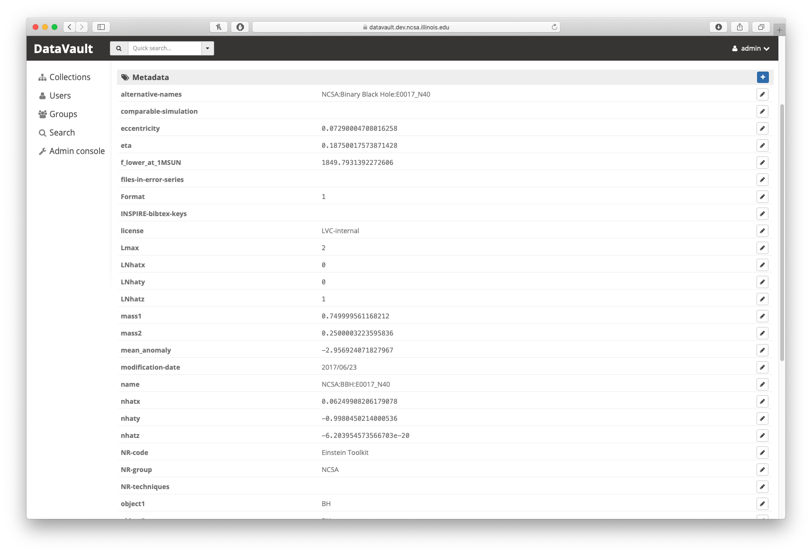
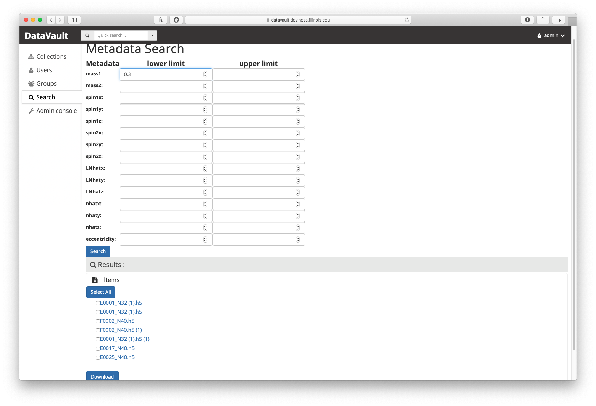
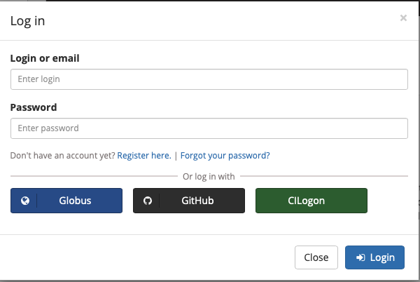
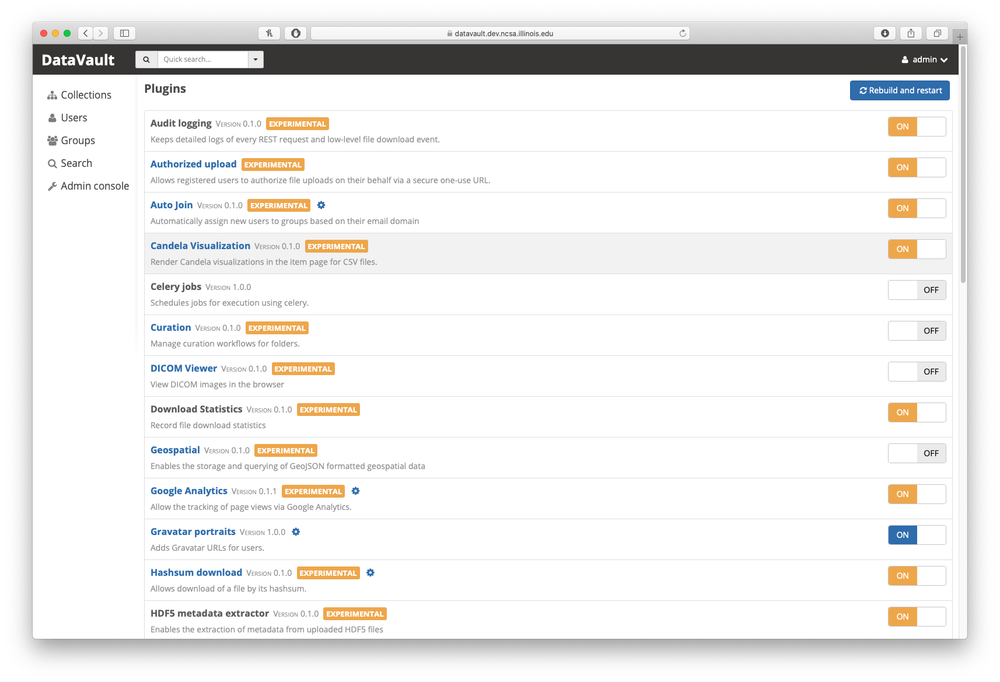

# Documentation for DataVault

## 1. Introduction

DataVault is the data repository for the Einstein Toolkit community. It is based on [Girder](https://github.com/girder/girder) platform, which has three main parts: front end using JavaScript, backend using Python, and the plugins for extending the functionality. The database used is MongoDB. For more detailed information about the general infrastructure of the Girder platform please check the following link for documentation.

https://girder.readthedocs.io/en/v2.5.0/index.html

DataVault is built on the Girder and the version information are listed below.

``` 
Python: 2.7
Girder: 2.5.0
```

Its github repo is
https://github.com/Brookluo/girder

```
Branch: 2.x-maintenance
Commit: 3e3e57905455d7a754efd446d7b17016059ee2e3
```

Since Girder is a bare-bone data platform, any additional customized functionalities are added through plugins to the DataVault. All plugins should be put into the __plugins__ directory. Currently, the additional functionalities have been implemented are metadata search, metadata extraction, CILogon and download.

## 2. Deployment

### 2.0 Software prerequisite

For the proxy server, the Nginx is used, the configuration file of the Nginx server has been provided below.

```
user nginx;
worker_processes auto;
error_log /var/log/nginx/error.log;
pid /run/nginx.pid;

# Load dynamic modules. See /usr/share/nginx/README.dynamic.
include /usr/share/nginx/modules/*.conf;

events {
    worker_connections 1024;
}

http {
    log_format  main  '$remote_addr - $remote_user [$time_local] "$request" '
                      '$status $body_bytes_sent "$http_referer" '
                      '"$http_user_agent" "$http_x_forwarded_for"';

    access_log  /var/log/nginx/access.log  main;

    sendfile            on;
    tcp_nopush          on;
    tcp_nodelay         on;
    keepalive_timeout   65;
    types_hash_max_size 2048;

    include             /etc/nginx/mime.types;
    default_type        application/octet-stream;

    # Load modular configuration files from the /etc/nginx/conf.d directory.
    # See http://nginx.org/en/docs/ngx_core_module.html#include
    # for more information.
    include /etc/nginx/conf.d/*.conf;

    server {
        listen       80 default_server;
        listen       [::]:80 default_server;
        server_name  _;
        root         /usr/share/nginx/html;
        return 301 https://$host$request_uri;

        # Load configuration files for the default server block.
        include /etc/nginx/default.d/*.conf;


        error_page 404 /404.html;
            location = /40x.html {
        }

        error_page 500 502 503 504 /50x.html;
            location = /50x.html {
        }
    }

# Settings for a TLS enabled server.

    server {
        listen       443 ssl http2 default_server;
        listen       [::]:443 ssl http2 default_server;
        server_name  _;
        root         /usr/share/nginx/html;

        ssl_certificate "/etc/pki/nginx/server.crt";
        ssl_certificate_key "/etc/pki/nginx/private/server.key";
        ssl_session_cache shared:SSL:1m;
        ssl_session_timeout  10m;
        ssl_ciphers HIGH:!aNULL:!MD5;
        ssl_prefer_server_ciphers on;

        # Load configuration files for the default server block.
        include /etc/nginx/default.d/*.conf;


        error_page 404 /404.html;
            location = /40x.html {
        }

        error_page 500 502 503 504 /50x.html;
            location = /50x.html {
        }
    }

}
```

The configuration for girder is also provided, the [docs](https://girder.readthedocs.io/en/v2.5.0/deploy.html#girder-settings) also provide a template and explains the params in a good manner.

```
location / {
    proxy_set_header Host $proxy_host;
    proxy_set_header X-Forwarded-For $proxy_add_x_forwarded_for;
    proxy_set_header X-Forwarded-Host $host;
    proxy_set_header X-Forwarded-Proto $scheme;
    proxy_pass http://localhost:9000/;
    # Must set the following for SSE notifications to work
    proxy_buffering off;
    proxy_cache off;
    proxy_set_header Connection '';
    proxy_http_version 1.1;
    chunked_transfer_encoding off;
    proxy_read_timeout 600s;
    proxy_send_timeout 600s;
    # proxy_request_buffering option only works on nginx >= 1.7.11
    # but is necessary to support streaming requests
    proxy_request_buffering off;
}

    client_max_body_size 500M;
    # ... elided configuration
```

To deploy the DataVault in a containerized environment, we used docker, and all the other requirement package will be installed automatically when the image is created.

To deploy it in the VM environment directly, first clone the image and in the root directory, run

```
pip install --upgrade --upgrade-strategy eager --editable .[plugins] &&
```

To install all the required python package for the DataVault
### 2.1 Docker deployment 

The DataVault has already been containerized, so the deployment of a working instance can be done through docker. First, checkout the Dockerfile from the git repository

```
git clone --branch 2.x-maintenance https://github.com/Brookluo/datavault
```

After you set up the external Nginx proxy, you may want to change some parameters, such as port number and volume mounting for your local instance of DataVault according to the Nginx configuration. Any configuration for the DataVault should be made in the file __girder.dist.cfg__. You should always make changes in the dist config file rather than the local config, since the local cfg is generated based on the dist config file. 

To deploy the instance, in the datavault folder, first build the docker image

```shell
docker-compose build
```

If you have built the image before, but it could not build properly in the current session, try building the image again with ```--no-cache``` flag to rebuild the image completely. Docker will tend to use the cache that you have built before to reduce the deployment time and resources, but it might cause error sometimes (such as updated packages).

To run the instance with the image,

```
docker-compose up
```

You should be able to see two containers running, one for mongoDB and the other one for the girder.

For Nginx, you should provide an external interface to the docker container. (For current implementation). Here are the two templates
https://gist.github.com/satra/ca6d9aad045a1d242302244421a67341
https://gist.github.com/rcurrie/eb480a292ece38561f19923fdf88e3ba

#### Important notice

During the development, we find that sometime the OS might not be compatible with the default docker IO interface. Thus, we have to change the storage driver. This issue and solution could be found here

https://docs.docker.com/storage/storagedriver/select-storage-driver/

We used the ```devicemapper``` to run with CentOS 7.

### 2.2 Install on virtual machine

To deploy directly on virtual machine, you could follow the [documentation](https://girder.readthedocs.io/en/v2.5.0/installation.html) for the installation process. 
Compared to the docker image, girder installed on the local machine are easier for testing purpose and making changes because for any changes in the plugins, you don't need to rebuild the whole image for it to work.

## 3. Plugins

Each plugin is a single directory in the __plugins__ directory. It should contain a folder __server__ for the backend implementation, a folder __web_client__ for front end and a ```plugin.json``` to register the plugin and list the info.

### 3.1 Metadata Extraction

[Source](https://github.com/Brookluo/girder/tree/2.x-maintenance/plugins/hdf5_metadata_extractor)



The metadata is extracted when user uploads the files. While uploading, the server checks whether it is a hdf5 file and if so, the metadata is read out using h5py. The action to extract the metadata is performed when the uploading event is triggered and metadata is stored in the mongoDB as meta information of the files. Though the metadata could be manipulated by user through web interface, but this modification only changes information stored in the MongoDB but not the file itself. A figure has been shown above to illustrate what should be observed with this functions after uploading a waveform with metadata.


### 3.2 Metadata Search with Download

[Source](https://github.com/Brookluo/girder/tree/2.x-maintenance/plugins/mongo_search_datavault)



```SearchView.js```

The meta search is based on the API calls to search through MongoDB for specific criteria. The key feature is the front end implementation. Based on the NR paper, we constructed search box for each searchable metadata (i.e. it is a numerical value). Either a lower limit or upper limit or both should be specified to search for the waveforms fit in the criteria. The RESTful endpoint is resource/mongo_search. 

After the search is performed, user could select the results they are interested in. After that the request is sent to the RESTful endpoint resource/download. The selection/unselect/invert buttons are also implemented in the SearchView.js

### 3.3 CILogon

[Source](https://github.com/Brookluo/girder/tree/2.x-maintenance/plugins/oauth)



The CILogon is an addition to the existing OAuth login methods. In the provider folder, the [cilogon.py](https://github.com/Brookluo/girder/blob/2.x-maintenance/plugins/oauth/server/providers/cilogon.py) specifies the endpoint for the user to authenticate and the information we are looking for to create profile for the user. The User will then be taken to the CILogon page to authenticate using their preferred method. After that, the user is directed back with the account associated with the information sent from the CILogon system. The token generated by the system will be based on the user information. 

The CILogon plugin is based on the Oauth2 plugins that has been implemented in girder. However, for CILogon plugin, the front end has been changed to add the additional button. For the backend, the authentication urls are specified and the callback url is also given. You could check those changes in the source code section. Note that you have to register your callback url with the CILogon service to setup the Oauth2 authentication with CILogon. 

## 4. Extending the functionality

### Workflow for adding or modifying plugins

- The frontend structure

The frontend (model) is implemented in the __web_server__ directory. It should inherit the parent view from the "girder/views/Views". In addition, the girder should also include the rest endpoint and API calls.

```JavaScript
import View from 'girder/views/View';
import { restRequest, getApiRoot } from 'girder/rest';
```

There is a template folder which is used to store the html configuration (.pug) of the webpage we are trying to render. For the pug.js, you could follow this [link](https://pugjs.org/api/getting-started.html) and [code](https://pugjs.org/language/code.html) for more information and examples. Instead of the static html, pug is more flexible and easier to extend different components. 

If the requests and data are to be sent to the backend, always remember to use getApiRoot() function to follow the correct url address. For example, if we want to request to download some data, the url should be

```JavaScript
var url = getApiRoot() + '/resource/download';
```

- The backend structure

The backend is implemented in the python. It sets up the restful endpoint for the API calls. To let either user or the frontend make the API call, the endpoint should be registered and attached to the info. This should be achieved by defining the load function to the ```__init__.py```. Remember to use decorator to describe the expected input and output. An example (the mongo metadata search) is giving [here](https://github.com/Brookluo/girder/tree/2.x-maintenance/plugins/mongo_search_datavault/server). 

- The event system

The event system has been discussed in the [following link](https://girder.readthedocs.io/en/v1.6.0/plugin-development.html#the-events-system). It lists some of the available events that has been implemented in the girder. You could also add new events and handlers by following the instructions listed above.

### Interact with the web interface



There is a webUI for the DataVault. To manipulate the plugins, you must login as an admin. With the web UI, you will be able to turn on or off the plugin service and adding email notifications. Note that some plugin service has dependence on other plugins so it could not be turned off before its dependent turned off. To assign admin to users, you need to hard-code it to the mongoDB.

For the DataVault, we have enabled the email confirmation to let the user login.

### Rebuilding the server

In most of the cases, if a new plugins is implemented and added to the DataVault, the server needs to be restarted and rebuilt. However, to shorten the restarting time, it is suggested that all unnecessary plugins be turned off, so when the server build the frontend, it could be faster and use fewer resources.

### Error log

In the __girder.dist.cfg__ file, the error logging info, including building error and the errors encountered during the running will be logged to the path specified.

For the logging info, you could specify the level of information you would like girder to log. This could be done by changing the log_level parameter in __girder.dist.cfg__. More info can be found through [this link](https://girder.readthedocs.io/en/v2.5.0/configuratio n.html#logging). 

